# NBEE CMS — Entity Relationship Diagram

> 生成日期：2026-05-04
> 來源：Live DB (`demo_cms` on Neon)
> 表數：35
> 外鍵：21

---

## 📊 整體 Domain 概覽

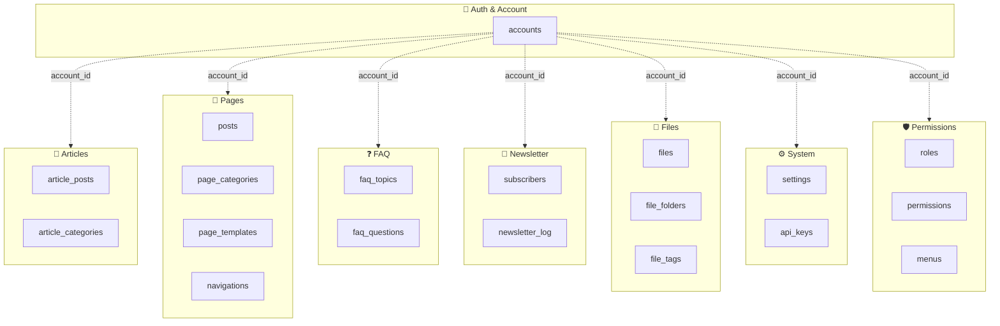

---

## 🔐 Auth & Account

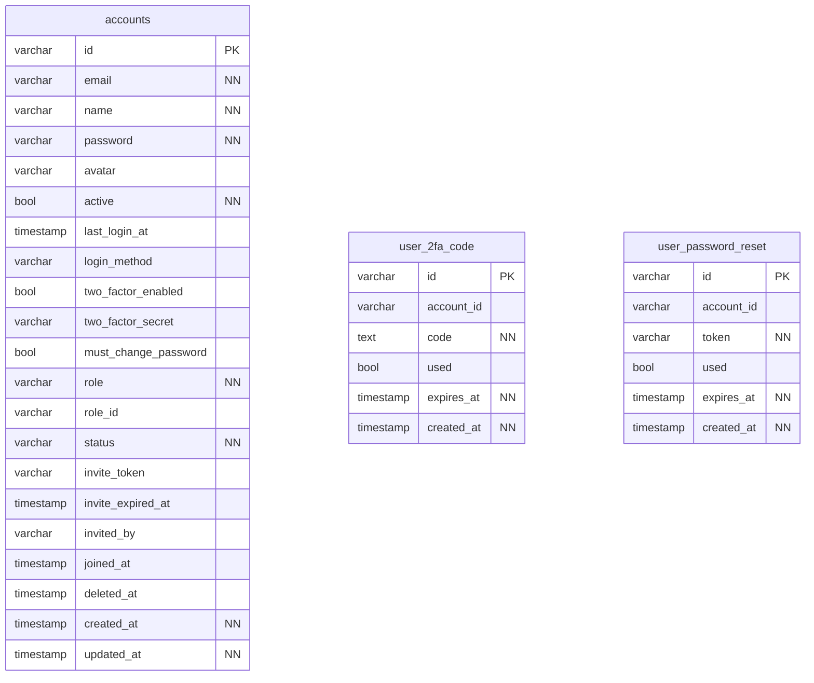

**Tables:**

- `accounts` — 帳號（FDW 關聯到 Platform.accounts）
- `user_2fa_code` — 2FA 驗證碼
- `user_password_reset` — 密碼重置 token

---

## 🛡️ Permissions

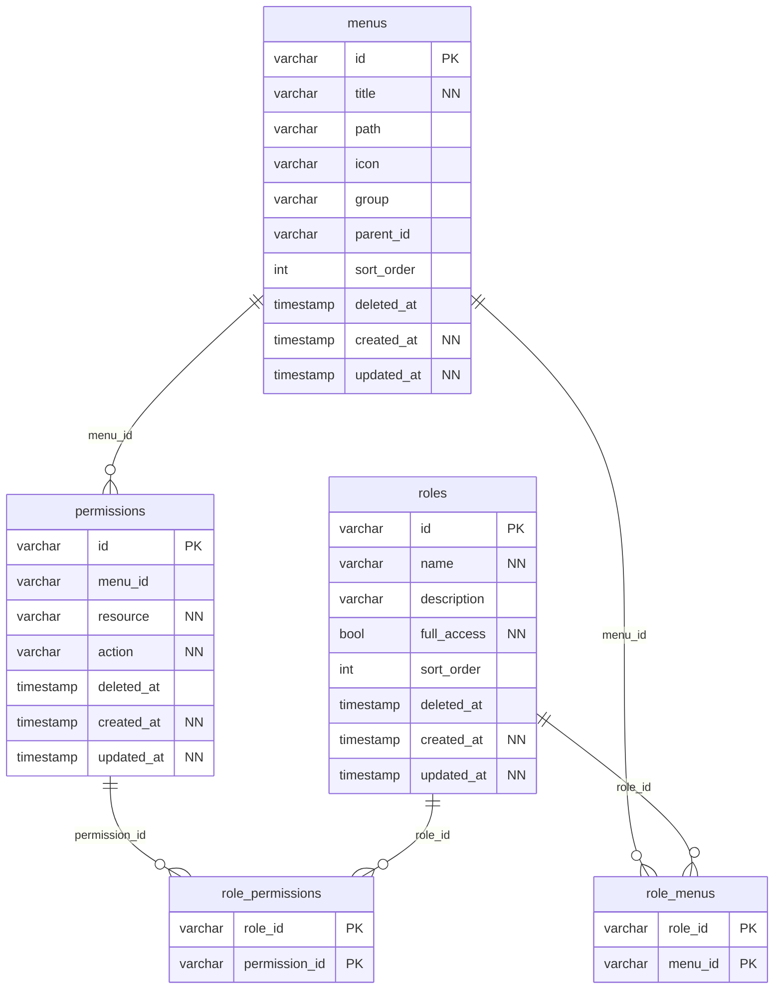

**Tables:**

- `roles` — 角色
- `permissions` — 權限
- `menus` — 選單
- `role_permissions` — 角色 ↔ 權限
- `role_menus` — 角色 ↔ 選單

---

## 🔑 API Keys

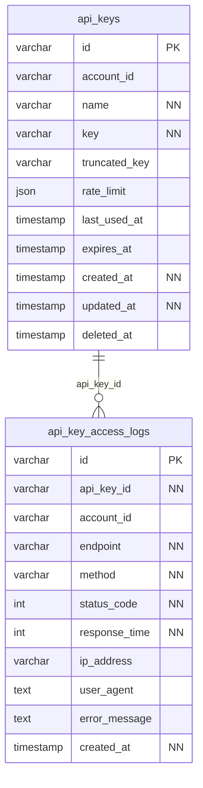

**Tables:**

- `api_keys` — API Key
- `api_key_access_logs` — API Key 訪問紀錄

---

## 📰 Articles

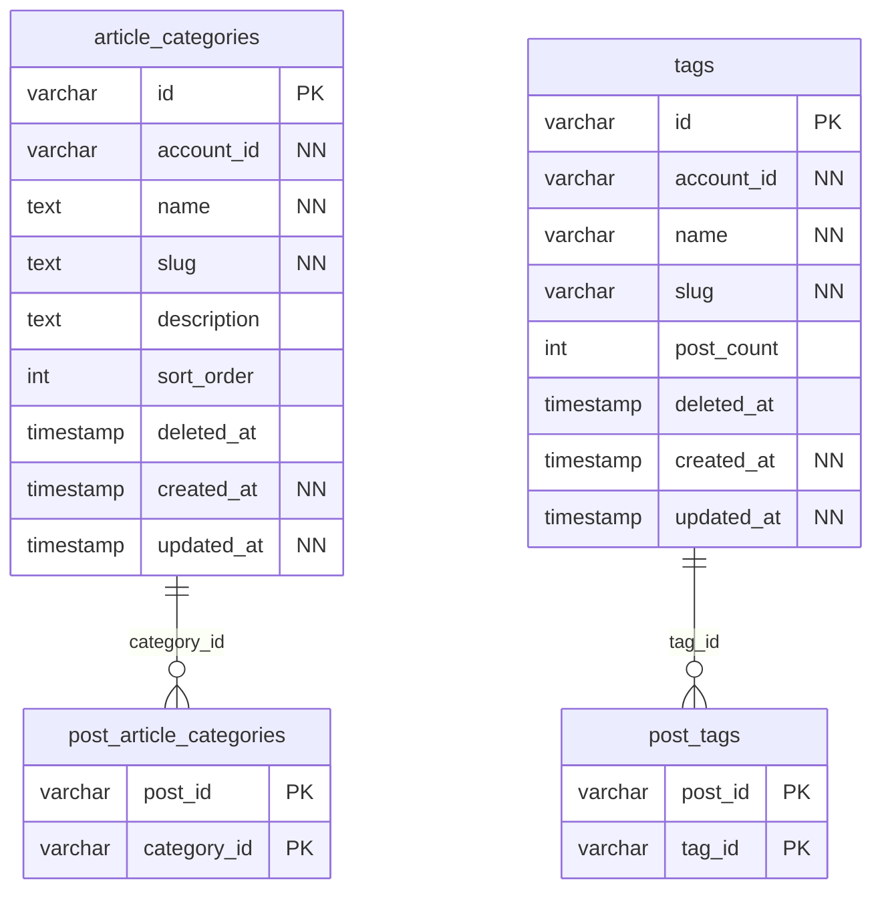

**Tables:**

- `article_categories` — 文章分類
- `post_article_categories` — 文章 ↔ 分類關聯
- `post_tags` — 文章 ↔ 標籤關聯
- `tags` — 標籤

---

## 📄 Pages & Products

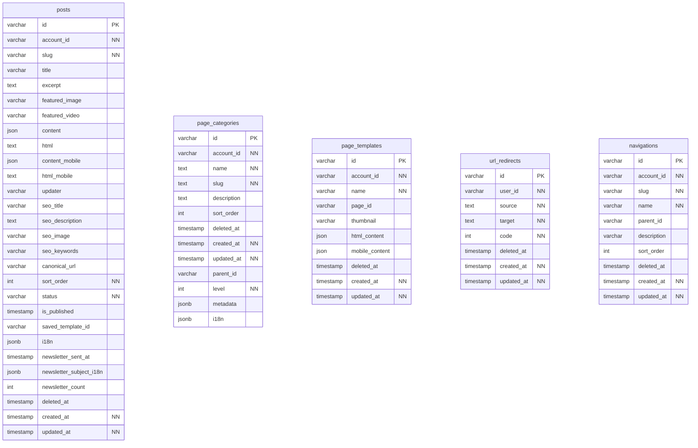

**Tables:**

- `posts` — Pages（頁面/產品）
- `page_categories` — 頁面分類
- `page_templates` — 頁面模板
- `url_redirects` — URL 重導向
- `navigations` — 網站導航

---

## ❓ FAQ

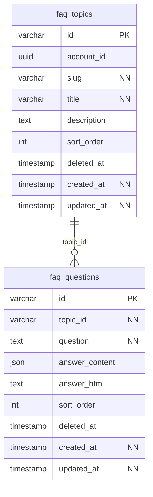

**Tables:**

- `faq_topics` — FAQ 主題
- `faq_questions` — FAQ 題目

---

## 📧 Newsletter

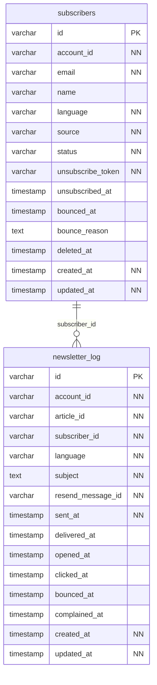

**Tables:**

- `subscribers` — Newsletter 訂閱者
- `newsletter_log` — Newsletter 寄送紀錄

---

## 📁 Files

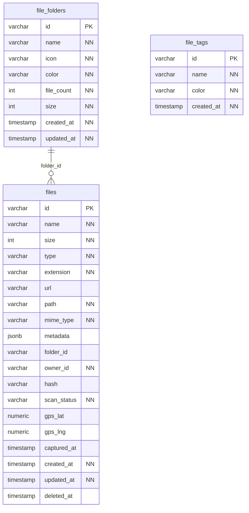

**Tables:**

- `files` — 檔案
- `file_folders` — 檔案資料夾
- `file_tags` — 檔案標籤

---

## ⚙️ System

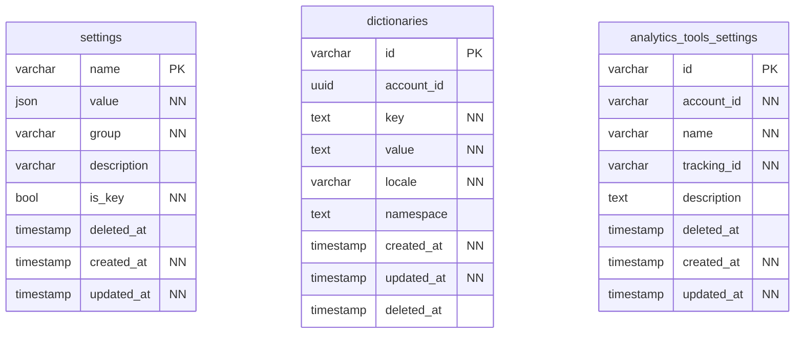

**Tables:**

- `settings` — 系統設定
- `dictionaries` — 字典 / 詞庫
- `analytics_tools_settings` — 分析工具設定

---

## 🌐 完整 ER Diagram（所有表）

展開查看完整關係圖（35 表 + 21 FK）

```mermaid
erDiagram
  accounts {
    varchar id "PK"
    varchar email "NN"
    varchar name "NN"
    varchar password "NN"
    varchar avatar
    bool active "NN"
    timestamp last_login_at
    varchar login_method
    bool two_factor_enabled
    varchar two_factor_secret
    bool must_change_password
    varchar role "NN"
    varchar role_id
    varchar status "NN"
    varchar invite_token
    timestamp invite_expired_at
    varchar invited_by
    timestamp joined_at
    timestamp deleted_at
    timestamp created_at "NN"
    timestamp updated_at "NN"
  }
  analytics_tools_settings {
    varchar id "PK"
    varchar account_id "NN"
    varchar name "NN"
    varchar tracking_id "NN"
    text description
    timestamp deleted_at
    timestamp created_at "NN"
    timestamp updated_at "NN"
  }
  api_key_access_logs {
    varchar id "PK"
    varchar api_key_id "NN"
    varchar account_id
    varchar endpoint "NN"
    varchar method "NN"
    int status_code "NN"
    int response_time "NN"
    varchar ip_address
    text user_agent
    text error_message
    timestamp created_at "NN"
  }
  api_keys {
    varchar id "PK"
    varchar account_id
    varchar name "NN"
    varchar key "NN"
    varchar truncated_key
    json rate_limit
    timestamp last_used_at
    timestamp expires_at
    timestamp created_at "NN"
    timestamp updated_at "NN"
    timestamp deleted_at
  }
  article_categories {
    varchar id "PK"
    varchar account_id "NN"
    text name "NN"
    text slug "NN"
    text description
    int sort_order
    timestamp deleted_at
    timestamp created_at "NN"
    timestamp updated_at "NN"
  }
  dictionaries {
    varchar id "PK"
    uuid account_id
    text key "NN"
    text value "NN"
    varchar locale "NN"
    text namespace
    timestamp created_at "NN"
    timestamp updated_at "NN"
    timestamp deleted_at
  }
  faq_questions {
    varchar id "PK"
    varchar topic_id "NN"
    text question "NN"
    json answer_content
    text answer_html
    int sort_order
    timestamp deleted_at
    timestamp created_at "NN"
    timestamp updated_at "NN"
  }
  faq_topics {
    varchar id "PK"
    uuid account_id
    varchar slug "NN"
    varchar title "NN"
    text description
    int sort_order
    timestamp deleted_at
    timestamp created_at "NN"
    timestamp updated_at "NN"
  }
  file_folders {
    varchar id "PK"
    varchar name "NN"
    varchar icon "NN"
    varchar color "NN"
    int file_count "NN"
    int size "NN"
    timestamp created_at "NN"
    timestamp updated_at "NN"
  }
  file_tag_mapping {
    varchar id "PK"
    varchar file_id "NN"
    varchar tag_id "NN"
    timestamp created_at "NN"
  }
  file_tags {
    varchar id "PK"
    varchar name "NN"
    varchar color "NN"
    timestamp created_at "NN"
  }
  files {
    varchar id "PK"
    varchar name "NN"
    int size "NN"
    varchar type "NN"
    varchar extension "NN"
    varchar url
    varchar path "NN"
    varchar mime_type "NN"
    jsonb metadata
    varchar folder_id
    varchar owner_id "NN"
    varchar hash
    varchar scan_status "NN"
    numeric gps_lat
    numeric gps_lng
    timestamp captured_at
    timestamp created_at "NN"
    timestamp updated_at "NN"
    timestamp deleted_at
  }
  menus {
    varchar id "PK"
    varchar title "NN"
    varchar path
    varchar icon
    varchar group
    varchar parent_id
    int sort_order
    timestamp deleted_at
    timestamp created_at "NN"
    timestamp updated_at "NN"
  }
  navigation_menus {
    varchar id "PK"
    varchar navigation_id "NN"
    varchar slug "NN"
    varchar group
    varchar title "NN"
    varchar sub_title
    varchar icon
    varchar link_type "NN"
    varchar style "NN"
    varchar link "NN"
    bool target_blank "NN"
    bool enabled "NN"
    varchar parent_id
    int sort_order
    timestamp deleted_at
    timestamp created_at "NN"
    timestamp updated_at "NN"
  }
  navigations {
    varchar id "PK"
    varchar account_id "NN"
    varchar slug "NN"
    varchar name "NN"
    varchar parent_id
    varchar description
    int sort_order
    timestamp deleted_at
    timestamp created_at "NN"
    timestamp updated_at "NN"
  }
  newsletter_log {
    varchar id "PK"
    varchar account_id "NN"
    varchar article_id "NN"
    varchar subscriber_id "NN"
    varchar language "NN"
    text subject "NN"
    varchar resend_message_id "NN"
    timestamp sent_at "NN"
    timestamp delivered_at
    timestamp opened_at
    timestamp clicked_at
    timestamp bounced_at
    timestamp complained_at
    timestamp created_at "NN"
    timestamp updated_at "NN"
  }
  page_categories {
    varchar id "PK"
    varchar account_id "NN"
    text name "NN"
    text slug "NN"
    text description
    int sort_order
    timestamp deleted_at
    timestamp created_at "NN"
    timestamp updated_at "NN"
    varchar parent_id
    int level "NN"
    jsonb metadata
    jsonb i18n
  }
  page_category_relations {
    varchar post_id "PK"
    varchar category_id "PK"
  }
  page_templates {
    varchar id "PK"
    varchar account_id "NN"
    varchar name "NN"
    varchar page_id
    varchar thumbnail
    json html_content
    json mobile_content
    timestamp deleted_at
    timestamp created_at "NN"
    timestamp updated_at "NN"
  }
  pages {
    varchar id "PK"
    varchar account_id "NN"
    varchar slug "NN"
    varchar title
    text excerpt
    varchar featured_image
    varchar featured_video
    jsonb content
    text html
    json content_mobile
    text html_mobile
    varchar updater
    varchar status "NN"
    timestamp is_published
    varchar saved_template_id
    timestamp deleted_at
    timestamp created_at "NN"
    timestamp updated_at "NN"
    varchar type "NN"
    varchar parent_id
    jsonb i18n
    jsonb metadata
    jsonb visual_contents
  }
  permissions {
    varchar id "PK"
    varchar menu_id
    varchar resource "NN"
    varchar action "NN"
    timestamp deleted_at
    timestamp created_at "NN"
    timestamp updated_at "NN"
  }
  post_article_categories {
    varchar post_id "PK"
    varchar category_id "PK"
  }
  post_tags {
    varchar post_id "PK"
    varchar tag_id "PK"
  }
  posts {
    varchar id "PK"
    varchar account_id "NN"
    varchar slug "NN"
    varchar title
    text excerpt
    varchar featured_image
    varchar featured_video
    json content
    text html
    json content_mobile
    text html_mobile
    varchar updater
    varchar seo_title
    text seo_description
    varchar seo_image
    varchar seo_keywords
    varchar canonical_url
    int sort_order "NN"
    varchar status "NN"
    timestamp is_published
    varchar saved_template_id
    jsonb i18n
    timestamp newsletter_sent_at
    jsonb newsletter_subject_i18n
    int newsletter_count
    timestamp deleted_at
    timestamp created_at "NN"
    timestamp updated_at "NN"
  }
  product_categories {
    varchar id "PK"
    varchar parent_id
    text name "NN"
    text slug "NN"
    text description
    jsonb features
    jsonb technical_features
    jsonb content
    jsonb i18n
    int sort_order
    varchar status "NN"
    timestamp deleted_at
    timestamp created_at "NN"
    timestamp updated_at "NN"
  }
  products {
    varchar id "PK"
    text ref_id "NN"
    varchar category_id
    text title "NN"
    text model
    text summary
    text description
    jsonb content
    text html
    jsonb specifications
    jsonb images
    jsonb videos
    jsonb downloads
    text source_url
    jsonb i18n
    int sort_order
    varchar status "NN"
    timestamp deleted_at
    timestamp created_at "NN"
    timestamp updated_at "NN"
  }
  role_menus {
    varchar role_id "PK"
    varchar menu_id "PK"
  }
  role_permissions {
    varchar role_id "PK"
    varchar permission_id "PK"
  }
  roles {
    varchar id "PK"
    varchar name "NN"
    varchar description
    bool full_access "NN"
    int sort_order
    timestamp deleted_at
    timestamp created_at "NN"
    timestamp updated_at "NN"
  }
  settings {
    varchar name "PK"
    json value "NN"
    varchar group "NN"
    varchar description
    bool is_key "NN"
    timestamp deleted_at
    timestamp created_at "NN"
    timestamp updated_at "NN"
  }
  subscribers {
    varchar id "PK"
    varchar account_id "NN"
    varchar email "NN"
    varchar name
    varchar language "NN"
    varchar source "NN"
    varchar status "NN"
    varchar unsubscribe_token "NN"
    timestamp unsubscribed_at
    timestamp bounced_at
    text bounce_reason
    timestamp deleted_at
    timestamp created_at "NN"
    timestamp updated_at "NN"
  }
  tags {
    varchar id "PK"
    varchar account_id "NN"
    varchar name "NN"
    varchar slug "NN"
    int post_count
    timestamp deleted_at
    timestamp created_at "NN"
    timestamp updated_at "NN"
  }
  url_redirects {
    varchar id "PK"
    varchar user_id "NN"
    text source "NN"
    text target "NN"
    int code "NN"
    timestamp deleted_at
    timestamp created_at "NN"
    timestamp updated_at "NN"
  }
  user_2fa_code {
    varchar id "PK"
    varchar account_id
    text code "NN"
    bool used
    timestamp expires_at "NN"
    timestamp created_at "NN"
  }
  user_password_reset {
    varchar id "PK"
    varchar account_id
    varchar token "NN"
    bool used
    timestamp expires_at "NN"
    timestamp created_at "NN"
  }
  roles ||--o{ accounts : "role_id"
  api_keys ||--o{ api_key_access_logs : "api_key_id"
  faq_topics ||--o{ faq_questions : "topic_id"
  files ||--o{ file_tag_mapping : "file_id"
  file_tags ||--o{ file_tag_mapping : "tag_id"
  file_folders ||--o{ files : "folder_id"
  posts ||--o{ newsletter_log : "article_id"
  subscribers ||--o{ newsletter_log : "subscriber_id"
  page_categories ||--o{ page_category_relations : "category_id"
  pages ||--o{ page_category_relations : "post_id"
  page_templates ||--o{ pages : "saved_template_id"
  menus ||--o{ permissions : "menu_id"
  article_categories ||--o{ post_article_categories : "category_id"
  posts ||--o{ post_article_categories : "post_id"
  posts ||--o{ post_tags : "post_id"
  tags ||--o{ post_tags : "tag_id"
  product_categories ||--o{ products : "category_id"
  menus ||--o{ role_menus : "menu_id"
  roles ||--o{ role_menus : "role_id"
  permissions ||--o{ role_permissions : "permission_id"
  roles ||--o{ role_permissions : "role_id"
```

---

## 📋 Table Summary

| Table | Columns | 說明 |
|-------|---------|------|
| `accounts` | 21 | 帳號（FDW 關聯到 Platform.accounts） |
| `analytics_tools_settings` | 8 | 分析工具設定 |
| `api_key_access_logs` | 11 | API Key 訪問紀錄 |
| `api_keys` | 11 | API Key |
| `article_categories` | 9 | 文章分類 |
| `dictionaries` | 9 | 字典 / 詞庫 |
| `faq_questions` | 9 | FAQ 題目 |
| `faq_topics` | 9 | FAQ 主題 |
| `file_folders` | 8 | 檔案資料夾 |
| `file_tag_mapping` | 4 | — |
| `file_tags` | 4 | 檔案標籤 |
| `files` | 19 | 檔案 |
| `menus` | 10 | 選單 |
| `navigation_menus` | 17 | — |
| `navigations` | 10 | 網站導航 |
| `newsletter_log` | 15 | Newsletter 寄送紀錄 |
| `page_categories` | 13 | 頁面分類 |
| `page_category_relations` | 2 | — |
| `page_templates` | 10 | 頁面模板 |
| `pages` | 23 | — |
| `permissions` | 7 | 權限 |
| `post_article_categories` | 2 | 文章 ↔ 分類關聯 |
| `post_tags` | 2 | 文章 ↔ 標籤關聯 |
| `posts` | 28 | Pages（頁面/產品） |
| `product_categories` | 14 | — |
| `products` | 20 | — |
| `role_menus` | 2 | 角色 ↔ 選單 |
| `role_permissions` | 2 | 角色 ↔ 權限 |
| `roles` | 8 | 角色 |
| `settings` | 8 | 系統設定 |
| `subscribers` | 14 | Newsletter 訂閱者 |
| `tags` | 8 | 標籤 |
| `url_redirects` | 8 | URL 重導向 |
| `user_2fa_code` | 6 | 2FA 驗證碼 |
| `user_password_reset` | 6 | 密碼重置 token |

## 🔗 Foreign Keys

| From | Column | → | To | Column |
|------|--------|---|----|----|
| `accounts` | `role_id` | → | `roles` | `id` |
| `api_key_access_logs` | `api_key_id` | → | `api_keys` | `id` |
| `faq_questions` | `topic_id` | → | `faq_topics` | `id` |
| `file_tag_mapping` | `file_id` | → | `files` | `id` |
| `file_tag_mapping` | `tag_id` | → | `file_tags` | `id` |
| `files` | `folder_id` | → | `file_folders` | `id` |
| `newsletter_log` | `article_id` | → | `posts` | `id` |
| `newsletter_log` | `subscriber_id` | → | `subscribers` | `id` |
| `page_category_relations` | `category_id` | → | `page_categories` | `id` |
| `page_category_relations` | `post_id` | → | `pages` | `id` |
| `pages` | `saved_template_id` | → | `page_templates` | `id` |
| `permissions` | `menu_id` | → | `menus` | `id` |
| `post_article_categories` | `category_id` | → | `article_categories` | `id` |
| `post_article_categories` | `post_id` | → | `posts` | `id` |
| `post_tags` | `post_id` | → | `posts` | `id` |
| `post_tags` | `tag_id` | → | `tags` | `id` |
| `products` | `category_id` | → | `product_categories` | `id` |
| `role_menus` | `menu_id` | → | `menus` | `id` |
| `role_menus` | `role_id` | → | `roles` | `id` |
| `role_permissions` | `permission_id` | → | `permissions` | `id` |
| `role_permissions` | `role_id` | → | `roles` | `id` |

---

## 📝 圖例

- **PK** = Primary Key
- **NN** = Not Null
- `||--o{` = One-to-Many 關係（FK）
- 灰色虛線（domain 圖）= 透過 `account_id` 邏輯關聯（FDW，無 FK constraint）
